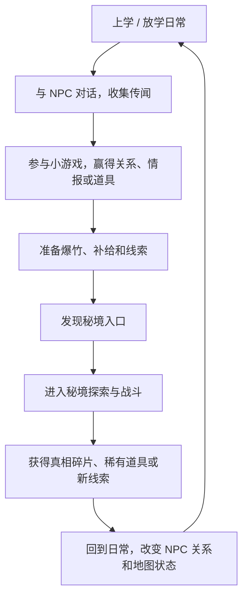

# 千禧年战纪 - 核心设计文档

## 1. 项目定位

《千禧年战纪》是一款以千禧年前后中国小学生童年经验为核心的梦核 TPS/RPG 游戏。

玩家扮演小学生，在家、学校、小卖部、街区和家属院中度过日常生活，通过儿童小游戏、NPC 对话、传闻收集和道具准备，进入黄昏后出现的城市秘境，使用爆竹、烟花和玩具武器进行探索与战斗。

一句话介绍：

> 在千禧年前后的中国小城里，一群小学生在放学后的黄昏中，用爆竹、玩具和童年游戏，探索只有孩子能看见的秘境世界。

## 2. 类型定义

| 维度   | 定位                                            |
| ---- | --------------------------------------------- |
| 核心类型 | 第三人称射击 TPS                                    |
| 副类型  | RPG、日常模拟、小游戏合集、城市秘境探索、箱庭探索                    |
| 结构   | 日常区域 + 秘境区域双层结构                               |
| 叙事形式 | 章节制主线 + NPC 支线 + 文本调查                         |
| 美术风格 | Early 2000s Low-Poly Game Style、PS2 低多边形、中式梦核 |
| 推荐视角 | 半俯视第三人称，兼顾移动、投掷、射击与空间观察                       |

## 3. 参考作品

| 作品 | 借鉴点 |
|---|---|
| 《女神异闻录5》 | 日常/非日常双重生活，时间段推进，角色关系 |
| 《放学后少年》 | 小学生视角，童年日常，小游戏承载怀旧体验 |
| 《孤胆枪手》 | 俯视/半俯视射击，敌人压迫感，持续战斗反馈 |
| 《极乐迪斯科》 | 文本深度，对话推进，内心声音，地图调查 |
| PS2 时代 3D 游戏 | 低多边形模型，低清贴图，略僵硬但有记忆点的动作 |

## 4. 设计支柱

### 4.1 千禧年中国小学生日常

游戏的情感根基来自具体而真实的童年经验：上学路、家属院、小卖部、操场、课间、楼道声控灯、红领巾、辣条、玻璃弹珠、圆牌、盗版卡片、爆竹、学校后门和黄昏。

这不是简单摆放怀旧道具，而是要让玩家感到：这些地方曾经被孩子们认真地当成一个完整世界。

### 4.2 儿童游戏与小学生江湖

小游戏不是附属娱乐，而是儿童社会的规则系统。

小游戏应承担：

- 推进 NPC 关系
- 赢得情报
- 获得道具
- 建立地位和面子
- 表达竞争、结盟、背叛与翻盘
- 训练战斗中的预判、节奏和风险判断

代表小游戏：

- 小刀一把
- 弹弹珠
- 圆牌 / 拍牌
- 打纸片
- 躲猫猫
- 木头人
- 扔沙包
- 小卖部门口抽奖
- 盗版卡牌对战

### 4.3 黄昏之后的城市秘境

世界表面上是正常的中国小城。大人相信课本、新闻、学校和科学解释，但孩子们知道有些地方不对劲。

这些地方包括：

- 鬼屋
- 怪地方
- 不存在的楼层
- 消失的走廊
- 神秘街道
- 废弃二层楼
- 封死的地下室
- 小卖部后门后的异常空间

秘境不是普通地牢，而是童年想象、恐惧、传闻和现实空间的混合物。

### 4.4 爆竹、烟花与玩具武器战斗

战斗不是现代枪战换皮，而是儿童物品被幻想化后的战斗系统。

初始核心武器：

| 武器 | 定位 | 设计价值 |
|---|---|---|
| 摔炮 | 低伤害、低噪音、即时爆炸 | 潜行、补刀、低风险试探 |
| 擦炮 | 延迟爆炸、中范围 AOE | 预判、控场、逼位 |
| 魔术棒 | 持续射击、小伤害 | 稳定输出、压制 |
| 窜天猴 | 远程直线、高伤害、大噪音 | 爆发、风险决策、暴露位置 |

关键参数不只是伤害，还包括噪音、引线时间、弹道、暴露度、范围、恐吓值、稳定性和稀有度。

### 4.5 文本 RPG 深度

游戏应具有大量可读、可选择、可调查的文本内容。

文本的核心不是讲大设定，而是通过孩子的语言、误解、传闻、暗号、面子和内心声音，让玩家逐步理解这个世界。

具体规范见 [[05 文本风格手册]]。

## 5. 核心体验比例

| 层级 | 情绪 | 时间占比 | 内容 |
|---|---|---:|---|
| 日常线 | 怀旧、温馨、生活化 | 60% | 上学、放学、NPC、小游戏、小卖部、家庭 |
| 冒险线 | 紧张、刺激、梦核、压迫 | 40% | 秘境、爆竹战斗、探索、撤离、真相碎片 |

目标是让两种情绪互相衬托：温馨让冒险更危险，冒险让日常更珍贵。

## 6. 核心循环

## 7. 单日结构

建议采用时间段结构，但 Demo 阶段可以做成线性流程。

| 时间段 | 可进行内容 |
|---|---|
| 早晨 | 家庭对话、上学路、偶遇同学 |
| 上午 | 上课、纸条、老师点名、课堂事件 |
| 课间 | 小游戏、交换道具、打听传闻 |
| 午休 | 学校探索、秘密会议 |
| 放学后 | 小卖部、街区探索、小游戏挑战 |
| 黄昏 | 秘境入口出现，进入探索与战斗 |
| 夜晚 | 回家、整理背包、写日记、家庭剧情 |

## 8. 世界观总纲

安城是一座典型的中国中部工业小城。白天，城市属于大人：工厂、学校、家庭、作业、新闻联播、买菜和楼道里的脚步声。

但孩子们知道，世界还有另一面。学校后门的死胡同在黄昏后会多出一条街，废弃二层楼并不总在那里，封死的地下室会在周三传出算盘声。

大人不是反派。他们只是看不见，或者不愿意看见。

儿童组织“放学后”由本地孩子自发组成。它没有正式总部，只是一种共同身份。不同区域的小组织可能合作、竞争或敌对，但他们共享一个模糊目标：看看这个世界的真相。

## 9. 当前制作策略

### 9.1 第一阶段目标

第一阶段不做完整开放世界，而是做一个能证明核心循环成立的短 Demo。

推荐 Demo 名称：

> 《千禧年战纪：42号楼》

Demo 要验证：

- 日常探索是否有味道
- 小游戏是否能推动关系和线索
- 神秘商店是否有吸引力
- 爆竹战斗是否成立
- 中式梦核是否有辨识度
- 结尾是否能让玩家想继续探索

详细流程见 [[02 Demo流程文档 - 42号楼]]。

### 9.2 范围控制

Demo 必须做：

- 一个主角：小陈
- 一个学校区域
- 一个小卖部
- 一条学校后巷
- 一个神秘商店
- 一个小游戏：小刀一把
- 一个小型秘境：42号楼
- 四种爆竹武器
- 三类敌人
- 一个简单 Boss
- 一条完整短任务

Demo 暂时不做：

- 多主角
- 完整开放世界
- 农村区域
- 城市多分会
- 复杂组织系统
- 大规模交易系统
- 大量小游戏
- 多结局
- 复杂家庭模拟

## 10. 安全与表现边界

由于主要角色是儿童，所有儿童之间的冲突应避免写实伤害表达。

推荐使用：

- 出局
- 被判负
- 被击退
- 失去勇气
- 火花熄灭
- 被梦境吞没
- 回到现实

避免使用：

- 真实死亡
- 写实致伤
- 血腥表现
- 未成年人之间的真实致命暴力

“小刀一把”应被表现为儿童规则游戏，而不是写实武器伤害。

## 11. 当前未决问题

| 问题 | 推荐方向 |
|---|---|
| 镜头是肩后 TPS 还是半俯视 TPS | Demo 用半俯视第三人称 |
| 大组织叫什么 | 大组织叫“放学后”，小游戏叫“小刀一把” |
| 秘境敌人是什么 | 优先做幻想化敌人，不做真实小孩敌人 |
| 世界真相是什么 | Demo 只埋钩子，不解释终局真相 |
| 时间系统有多严格 | Demo 线性，正式版再做行动次数限制 |
| 多主角何时加入 | Demo 成立后再做章节制扩展 |

## 12. 关联文档

- [[02 Demo流程文档 - 42号楼]]
- [[03 系统需求表]]
- [[04 内容表]]
- [[05 文本风格手册]]

