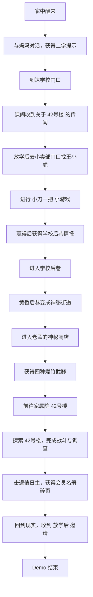

# Demo 流程文档 - 42号楼

## 1. Demo 定位

Demo 名称：

> 《千禧年战纪：42号楼》

Demo 目标是验证《千禧年战纪》的最小闭环：

```text
日常探索 -> 小游戏 -> 获得情报 -> 神秘商店 -> 秘境探索 -> 爆竹战斗 -> 组织邀请
```

Demo 时长目标：10 到 20 分钟。

## 2. Demo 范围

### 2.1 必须包含

| 类别 | 内容 |
|---|---|
| 主角 | 小陈，11 岁，纺织厂子弟小学五年级 |
| 场景 | 家、学校门口、小卖部、学校后巷、神秘街道、42号楼 |
| NPC | 妈妈、王小虎、阿杰、老孟、神秘商店老板 |
| 小游戏 | 小刀一把 |
| 武器 | 摔炮、擦炮、魔术棒、窜天猴 |
| 敌人 | 纸团怪、影子小孩、巡逻保安幻影 |
| Boss | 42号楼楼道尽头的“值日生” |
| 系统 | 移动、交互、对话、任务、背包、武器、敌人、场景切换 |

### 2.2 暂不包含

- 弹珠、圆牌等其他小游戏
- 多主角
- 完整上课系统
- 完整时间管理
- 大规模开放城市
- 复杂组织声望
- 可重复刷秘境
- 多结局

## 3. Demo 玩家流程



## 4. 场景设计

### 4.1 家

功能：

- 开场叙事
- 展示小陈家庭背景
- 教玩家基础交互
- 给出“今天放学早点回来”的软压力

关键交互：

| 物体 / 人物 | 功能 |
|---|---|
| 妈妈 | 开场对话，提醒上学，给 2 元零花钱 |
| 书包 | 获得初始背包 |
| 电视机 | 播放模糊广告或动画片，制造时代感 |
| 抽屉 | 可调查，发现旧擦炮包装 |
| 挂历 | 显示日期，强调黄昏和星期 |

开场目标：

> 出门上学。

### 4.2 学校门口

功能：

- 第一个日常中心
- NPC 聚集
- 引出小卖部和小刀一把
- 建立怀旧气质

可见元素：

- 校门
- 小卖部
- 玻璃柜台
- 操场入口
- 水泥地
- 小学生围观
- 贴纸、辣条、干脆面、弹珠、圆牌

关键 NPC：

| NPC | 功能 |
|---|---|
| 王小虎 | 小刀一把对手，传闻持有者 |
| 阿杰 | 暗示儿童组织存在 |
| 小卖部老板老孟 | 普通商店老板，后续关联神秘商店 |

### 4.3 小卖部门口

功能：

- 小刀一把小游戏触发点
- 儿童社会展示点
- 第一次明确“情报是可以赢来的”

流程：

1. 玩家靠近王小虎。
2. 王小虎嘲笑小陈“不敢去 42号楼”。
3. 玩家可以选择追问、怂一下、嘴硬。
4. 王小虎提出玩“小刀一把”。
5. 玩家完成小游戏。
6. 胜利后获得学校后巷线索。

失败处理：

- 第一次失败不终止流程。
- 王小虎可以给玩家再来一次机会。
- 失败后玩家损失少量面子，但仍可通过阿杰获得模糊线索。

### 4.4 学校后巷

功能：

- 从日常进入异常的过渡空间
- 展示中式梦核
- 引出神秘街道

日常状态：

- 普通后巷
- 堆放旧桌椅
- 墙上有粉笔涂鸦
- 尽头被铁门锁住

黄昏状态：

- 铁门后多出一条街
- 学校铃声变远
- 墙上涂鸦变成箭头
- 地上的粉笔线指向神秘商店

触发条件：

- 完成小刀一把，获得王小虎情报
- 当前阶段推进到“放学后 / 黄昏”

### 4.5 神秘街道与神秘商店

功能：

- 将日常道具升级为战斗道具
- 给玩家第一次备战体验
- 建立老孟的神秘身份

神秘商店设定：

老孟在白天是普通小卖部老板。黄昏后，他似乎仍然是老孟，但店的位置、货架和语气都不对。

售卖 / 提供：

| 道具 | Demo 获取方式 |
|---|---|
| 摔炮 | 免费赠送，作为教学武器 |
| 擦炮 | 用零花钱购买 |
| 魔术棒 | 老孟借给玩家，要求回来还 |
| 窜天猴 | 任务道具，数量有限 |

关键对话目标：

- 说明爆竹在“那边”会变得有用
- 提醒声音会引来东西
- 提醒天黑前回来

### 4.6 42号楼

功能：

- Demo 主秘境
- 验证探索、战斗、解谜、撤离
- 结尾给出组织邀请

空间结构建议：

```text
入口楼道
  -> 一楼门厅：摔炮教学，纸团怪
  -> 二楼走廊：擦炮教学，多个敌人
  -> 废弃教室：魔术棒教学，持续压制
  -> 楼梯间：窜天猴教学，远程爆发
  -> 楼道尽头：Boss 值日生
  -> 旧储物柜：会员名册碎页
```

氛围：

- 楼道声控灯延迟亮起
- 墙上有褪色的优秀班级流动红旗
- 空教室里有课桌，但椅子全朝门口
- 黑板上写着“今天谁值日”
- 楼梯似乎比外面看起来更长

## 5. 任务线

### 5.1 主任务：42号楼的名字

| 阶段 | 目标 | 触发 / 完成 |
|---|---|---|
| 1 | 出门上学 | 与妈妈对话后离家 |
| 2 | 找到王小虎 | 到学校门口小卖部 |
| 3 | 赢下小刀一把 | 完成小游戏 |
| 4 | 调查学校后巷 | 进入后巷并触发黄昏变化 |
| 5 | 进入神秘商店 | 与老孟对话 |
| 6 | 准备爆竹 | 获得四种武器 |
| 7 | 前往 42号楼 | 进入秘境入口 |
| 8 | 找到名册碎页 | 击退 Boss 后调查储物柜 |
| 9 | 回到现实 | 自动传送或原路撤离 |
| 10 | 收到邀请 | 触发结尾纸条 |

### 5.2 支线钩子

Demo 中只埋钩子，不展开。

| 钩子 | 用途 |
|---|---|
| 阿杰已经在会员名册上 | 后续揭示阿杰的隐藏身份 |
| 老孟知道“那边”的规则 | 后续神秘商店线 |
| 42号楼不在现实地图上 | 后续城市秘境设定 |
| 王小虎不是坏人，只是嘴硬 | 后续儿童组织关系 |

## 6. 小刀一把小游戏 Demo 版

### 6.1 设计目标

用 2 到 3 分钟让玩家理解儿童江湖的规则：行动权、地盘、面子、翻盘。

### 6.2 棋盘抽象

```text
小陈家阵地 -> 中间地带 -> 王小虎家阵地
```

### 6.3 回合流程

1. 双方猜拳。
2. 胜者获得一次行动。
3. 行动后判断是否有人出局。
4. 无人出局则进入下一回合。

### 6.4 行动

| 行动 | 条件 | 效果 |
|---|---|---|
| 拿道具 | 在自己阵地 | 获得一级纸刀 |
| 前进 | 不在对方阵地 | 向前移动一格 |
| 出击 | 在对方阵地且有道具 | 使对方出局 |
| 抢道具 | 对方持有道具且在自己阵地 | 有概率夺取对方道具 |
| 防守 | 任意位置 | 下一次被抢或出击时提高防守成功率 |
| 嘴硬 | 任意位置 | 提升面子，但失败惩罚增加 |

### 6.5 胜负结果

胜利：

- 获得王小虎尊重
- 获得后巷线索
- 面子 +1

失败：

- 面子 -1
- 可再次挑战
- 阿杰给出备用线索，保证 Demo 不被卡死

## 7. 战斗教学

| 房间 | 教学武器 | 教学重点 |
|---|---|---|
| 一楼门厅 | 摔炮 | 即时爆炸、低噪音、小范围 |
| 二楼走廊 | 擦炮 | 延迟爆炸、预判移动 |
| 废弃教室 | 魔术棒 | 持续输出、保持距离 |
| 楼梯间 | 窜天猴 | 远程直线、高伤害、大噪音 |
| 楼道尽头 | 四种混用 | 根据敌人、距离和噪音选择武器 |

## 8. 敌人与 Boss

| 敌人 | 行为 | 用途 |
|---|---|---|
| 纸团怪 | 慢速接近，数量少 | 教学基础瞄准和摔炮 |
| 影子小孩 | 快速移动，绕侧面 | 逼玩家转移和使用擦炮 |
| 保安幻影 | 对声音敏感，无法彻底击败 | 教玩家控制噪音和绕行 |
| 值日生 | Boss，召唤纸团怪，黑板擦攻击 | Demo 结尾战斗 |

## 9. 结尾

Boss 被击退后，玩家在储物柜里发现一张旧名册碎页。

名册上有阿杰的名字，也有一个被墨水涂掉的名字。最下面写着：

> 放学后，到老地方。别告诉大人。

玩家回到现实，天还没完全黑。学校门口已经没人，小卖部卷帘门半关。玩家书包里多出一枚用圆牌磨出来的徽章。

屏幕显示：

> Demo 结束  
> 你已经被“放学后”注意到了。

## 10. 验收标准

Demo 完成时，玩家必须能完整体验：

- 移动和镜头
- 物体调查
- NPC 对话
- 对话选项
- 任务目标更新
- 小刀一把小游戏
- 获取道具
- 查看背包
- 切换四种爆竹武器
- 投掷 / 发射 / 爆炸
- 敌人受击和出局
- 秘境场景切换
- Boss 战
- 结尾剧情

## 11. 关联文档

- [[01 核心设计文档]]
- [[03 系统需求表]]
- [[04 内容表]]
- [[05 文本风格手册]]

