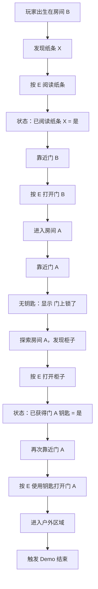

# 最小 Demo 设计文档 - 废弃小屋

## 1. 文档目的

这份文档用于交付给实现者，目标是明确第一版最小 Demo 要做什么、不做什么、玩家如何游玩、场景里有哪些对象、每个互动对象应该给出什么反馈。

本 Demo 不追求完整游戏表现，只验证基础探索流程是否成立。

> [!important] 当前版本原则
> 先做一个能完整走通的最小体验：玩家出生在房间 B，阅读纸条，打开门 B，进入房间 A，发现门 A 上锁，从房间 A 的柜子里取得钥匙，再用钥匙打开门 A，到达户外并结束 Demo。

## 2. Demo 目标

### 2.1 一句话介绍

这是一款 3D 上帝视角探索 Demo。玩家将在一个由两个房间和户外区域组成的小型场景中移动、观察、互动，并通过纸条提示找到离开废弃小屋的方法。

### 2.2 开发目的

这个 Demo 不是完整游戏，而是用来验证以下内容：

- 玩家角色能否流畅移动。
- 上帝视角 / 俯视角探索是否清楚、好操作。
- 小地图中是否有明确的探索目标。
- 玩家能否发现可互动物体。
- 玩家按键互动后是否能获得清楚反馈。
- 门、纸条、提示、场景出口这些基础要素是否能组成一个完整流程。
- Godot 的基础开发流程是否能够跑通。

### 2.3 Demo 完成标准

当玩家可以完成以下流程时，Demo 视为完成：

1. 进入游戏主场景。
2. 控制角色在地图中移动。
3. 靠近纸条、门 B、柜子、门 A 等可互动物体。
4. 按 E 触发互动。
5. 获得文本、提示或场景变化。
6. 从房间 B 进入房间 A。
7. 在房间 A 中发现门 A 上锁。
8. 从柜子中取得门 A 的钥匙。
9. 使用钥匙打开门 A。
10. 从房间 A 进入户外区域。
11. 到达户外后触发 Demo 结束提示。

## 3. 游戏核心体验

### 3.1 玩家视角

Demo 采用固定角度的上帝视角 / 俯视角镜头。这里的“第三人称”不是越肩视角，不是贴在角色背后的肩后镜头，而是能看见角色和周围环境的斜俯视 / 上帝视角。

参考方向：

- 《极乐迪斯科》：固定角度、场景可读性强、重视探索和调查。
- 《孤胆枪手》：固定角度、角色始终处于清晰视野中，适合后续射击玩法。

建议镜头特征：

- 镜头角度固定，不允许玩家旋转镜头。
- 镜头始终跟随玩家角色移动。
- 镜头固定在角色上方的斜对角位置，形成稳定的俯视 / 等轴斜俯视观察。
- 镜头不要从房间正面或地图正轴方向观察，画面应像从房间一个斜对角看进去，避免房间看起来只是平面的正方形。
- 玩家可以清楚看到角色周围环境。
- 镜头不能贴近角色肩膀，不能做成越肩 TPS。
- 房间墙体不能遮挡关键互动物体。
- 画面重点是路线、门、纸条和出口，不强调电影化镜头。

### 3.1.1 镜头规则

| 项目 | 规则 |
|---|---|
| 镜头类型 | 固定角度跟随镜头 |
| 镜头构图 | 斜对角等轴视角 |
| 是否越肩 | 不是越肩视角 |
| 玩家是否能旋转镜头 | 不能 |
| 镜头是否跟随玩家 | 是 |
| 镜头主要服务 | 探索、路线识别、互动对象识别 |
| 参考游戏 | 《极乐迪斯科》、《孤胆枪手》 |

### 3.1.2 镜头验收要求

- 玩家移动时，镜头平滑或稳定跟随角色。
- 镜头只跟随玩家位置，不因为左右或上下输入产生额外晃动。
- 玩家不能通过鼠标、键盘或手柄旋转镜头。
- 房间 B、房间 A 和户外区域中的关键对象都能被看见。
- 纸条、门 B、柜子、门 A、终点触发区不能被墙体长期遮挡。
- 镜头不需要追求电影感，第一优先级是清楚、稳定、可读。

### 3.2 玩家主要行为

玩家在 Demo 中主要做以下事情：

- 移动
- 探索地图
- 观察环境
- 靠近可互动物体
- 按 E 互动
- 阅读提示
- 根据提示打开门
- 到达出口

### 3.3 核心循环

```text
探索区域 -> 发现可疑物体 -> 靠近互动 -> 获得信息或变化 -> 解锁新的探索目标
```

在本 Demo 中，循环具体表现为：

```text
房间 B 探索 -> 发现纸条 X -> 阅读“离开房间”提示 -> 打开门 B -> 进入房间 A -> 发现门 A 上锁 -> 搜索柜子 -> 获得钥匙 -> 打开门 A -> 到达户外
```

### 3.4 Demo 暂时不做的内容

为了控制范围，Demo 阶段暂时不做：

- 战斗系统
- 敌人系统
- 大型背包系统
- 复杂任务系统
- 多个大型地图
- 完整剧情
- 存档系统
- 商店系统
- 技能系统
- 多角色系统
- 对话分支
- 音效系统
- 正式美术资产

## 4. Demo 内容范围

### 4.1 地图概念

Demo 只制作一个小地图：废弃小屋。

废弃小屋由三个区域组成：

| 区域 | 类型 | 功能 |
|---|---|---|
| 房间 B | 室内起点 | 玩家出生点，纸条 X 所在房间 |
| 房间 A | 室内过渡区 | 连接房间 B 和户外区域 |
| 户外区域 | 终点区域 | 玩家离开小屋后到达，触发 Demo 结束 |

房间连接关系：

```text
房间 B -- 门 B -- 房间 A -- 门 A -- 户外区域
                         |
                       柜子
```

### 4.2 地图结构示意

```text
┌──────────────────────┐
│        房间 B         │
│                      │
│  玩家出生点           │
│                      │
│  纸条 X               │
│                      │
│              门 B     │
└───────────────┬──────┘
                │
┌───────────────┴──────┐
│        房间 A         │
│                      │
│  柜子 / 钥匙          │
│                      │
│                      │
│              门 A     │
└───────────────┬──────┘
                │
        户外区域 / 终点
```

### 4.3 Demo 场景目标

玩家在地图中的目标是：

> 找到出口，从房间 B 走到房间 A，在房间 A 中找到门 A 的钥匙，再从房间 A 走到户外区域。

### 4.4 Demo 流程

完整游玩流程如下：

1. 玩家进入主场景。
2. 玩家出生在房间 B。
3. 玩家看到房间 B 的基础环境。
4. 玩家移动并探索房间 B。
5. 玩家发现第一个可互动对象：纸条 X。
6. 玩家靠近纸条 X，屏幕显示互动提示。
7. 玩家按 E 阅读纸条。
8. 纸条显示文本：“离开房间。”
9. 玩家根据提示寻找门 B。
10. 玩家靠近门 B，屏幕显示互动提示。
11. 玩家按 E 互动门 B。
12. 门 B 打开，原本阻挡通行的位置变为可通过。
13. 玩家从房间 B 进入房间 A。
14. 玩家在房间 A 中探索。
15. 玩家发现门 A。
16. 玩家靠近门 A，屏幕显示互动提示。
17. 玩家按 E 互动门 A。
18. 如果玩家还没有钥匙，文本框显示：“门上锁了。”
19. 玩家继续探索房间 A。
20. 玩家发现柜子。
21. 玩家靠近柜子，屏幕显示互动提示。
22. 玩家按 E 互动柜子。
23. 文本框显示：“柜子里有一把钥匙。”
24. 玩家获得门 A 的钥匙。
25. 玩家再次靠近门 A 并按 E 互动。
26. 文本框显示：“试着用刚才的钥匙，结果门打开了。”
27. 门 A 打开，玩家可以进入户外区域。
28. 玩家走到户外区域的终点触发范围。
29. 屏幕显示：“Demo 结束。”

## 5. 玩家角色设计

### 5.1 角色功能

Demo 阶段角色只需要具备：

- 八方向移动。
- 面向移动方向。
- 与附近物体互动。
- 触发区域检测。
- 被墙体和关闭的门阻挡。

### 5.2 操作方式

| 操作 | 功能 |
|---|---|
| W | 向上 / 前移动 |
| A | 向左移动 |
| S | 向下 / 后移动 |
| D | 向右移动 |
| E | 与附近物体互动 |
| Esc | 暂停或退出 |

### 5.3 移动要求

角色移动需要满足：

- 移动速度适中，不能过快导致错过互动物体。
- 角色不能穿墙。
- 未打开的门不能穿过。
- 障碍物可以阻挡角色。
- 操作反馈清晰。
- 停止移动时保持站立状态。
- 角色朝向应跟随最后一次移动方向。

### 5.4 角色出生点

| 项目 | 要求 |
|---|---|
| 出生区域 | 房间 B |
| 出生位置 | 房间 B 内部，距离墙体和纸条有一定距离 |
| 出生朝向 | 面向房间中央或纸条方向 |
| 初始状态 | 可移动、可互动、无道具、无任务 UI |

## 6. 互动系统设计

### 6.1 可互动对象类型

Demo 中计划加入 4 个可互动对象：

| 对象 | 所在区域 | 类型 | 功能 |
|---|---|---|---|
| 纸条 X | 房间 B | 文本对象 | 显示提示“离开房间” |
| 门 B | 房间 B / 房间 A 之间 | 门 | 打开后允许进入房间 A |
| 柜子 | 房间 A | 容器对象 | 打开后获得门 A 的钥匙 |
| 门 A | 房间 A / 户外之间 | 上锁的门 | 需要钥匙才能打开并进入户外区域 |

### 6.2 通用互动规则

当玩家靠近可互动对象时：

1. 屏幕显示互动提示。
2. 提示内容为：“E”或“按 E 互动”。
3. 玩家按 E。
4. 对象触发对应事件。
5. 屏幕显示结果，或场景状态发生变化。

### 6.3 互动提示规则

| 状态 | UI 表现 |
|---|---|
| 未靠近互动对象 | 不显示互动提示 |
| 靠近可互动对象 | 显示“E”或“按 E 互动” |
| 同时靠近多个对象 | 优先选择距离玩家最近的对象 |
| 完成互动后 | 提示消失或切换为新状态 |

### 6.4 纸条 X

| 项目 | 内容 |
|---|---|
| 名称 | 纸条 X |
| 位置 | 房间 B |
| 互动条件 | 玩家靠近纸条 |
| 互动按键 | E |
| 互动反馈 | 显示文本框 |
| 文本内容 | “离开房间。” |
| 互动后状态 | 纸条仍可再次阅读 |

建议文本框显示：

```text
纸条上写着：
离开房间。
```

### 6.5 门 B

| 项目 | 内容 |
|---|---|
| 名称 | 门 B |
| 位置 | 房间 B 与房间 A 之间 |
| 初始状态 | 关闭，阻挡玩家通行 |
| 互动条件 | 玩家靠近门 B |
| 互动按键 | E |
| 互动反馈 | 门打开，阻挡消失 |
| 打开后状态 | 玩家可从房间 B 进入房间 A |

第一版建议：

- 门 B 可以在玩家读完纸条后打开。
- 如果玩家没有读纸条就互动门 B，可以显示：“门像是能打开，但你还没有想好要去哪。”
- 读完纸条后再互动门 B，显示：“门打开了。”

> [!note] 实现简化方案
> 如果第一版想再简单一点，也可以允许门 B 一开始就能打开。但从策划角度，建议保留“读纸条 -> 开门”的顺序，这样玩家会明确感到互动产生了推进。

### 6.6 柜子

| 项目 | 内容 |
|---|---|
| 名称 | 柜子 |
| 位置 | 房间 A |
| 初始状态 | 关闭，可互动 |
| 互动条件 | 玩家靠近柜子 |
| 互动按键 | E |
| 互动反馈 | 显示文本框，获得门 A 的钥匙 |
| 互动后状态 | 柜子可以保持打开，钥匙状态变为已获得 |

建议文本：

```text
柜子里有一把钥匙。
```

如果玩家已经拿过钥匙，再次互动柜子时显示：

```text
柜子是空的。
```

> [!note] 实现简化方案
> 这里不需要完整背包系统。实现者只需要记录“玩家是否已经获得门 A 钥匙”这个状态即可。

### 6.7 门 A

| 项目 | 内容 |
|---|---|
| 名称 | 门 A |
| 位置 | 房间 A 与户外区域之间 |
| 初始状态 | 关闭，阻挡玩家通行 |
| 互动条件 | 玩家靠近门 A |
| 互动按键 | E |
| 无钥匙反馈 | 显示文本：“门上锁了。” |
| 有钥匙反馈 | 显示文本：“试着用刚才的钥匙，结果门打开了。” |
| 打开反馈 | 门打开，阻挡消失 |
| 打开后状态 | 玩家可进入户外区域 |
| 特殊作用 | 通向 Demo 终点 |

无钥匙时文本：

```text
门上锁了。
```

有钥匙后文本：

```text
试着用刚才的钥匙，结果门打开了。
```

## 7. 场景与地图设计

### 7.1 场景节点规划

Godot 中的场景可以初步拆分为：

| 场景 | 用途 |
|---|---|
| Main.tscn | 主游戏场景，负责加载地图、角色、UI |
| Player.tscn | 玩家角色 |
| Interactable.tscn | 可互动物体的基础场景 |
| UI.tscn | 互动提示与文本框 |
| Map.tscn | 废弃小屋地图 |

### 7.2 地图元素

Demo 地图中需要包含：

- 地面
- 墙体
- 门 A
- 门 B
- 柜子
- 门 A 的钥匙
- 纸条 X
- 玩家出生点
- 户外终点触发区
- 简单障碍物

可选装饰物：

- 破桌子
- 箱子
- 木板
- 灰色地毯
- 废纸
- 窗户
- 墙角阴影

### 7.3 地图尺寸

第一版地图不宜太大。

建议尺寸：

- 总地图约 1 到 3 个屏幕大小。
- 玩家 1 分钟内可以走完整张地图。
- 房间 B 应足够容纳出生点、纸条和移动空间。
- 房间 A 应比房间 B 略简单，重点是让玩家理解“我已经进入下一个空间”。
- 户外区域只需要做成小范围终点，不需要真正开放大地图。

### 7.4 碰撞与阻挡要求

| 元素 | 碰撞要求 |
|---|---|
| 墙体 | 必须阻挡玩家 |
| 关闭的门 | 必须阻挡玩家 |
| 打开的门 | 不再阻挡玩家 |
| 柜子 | 可阻挡玩家，也可只作为可互动对象 |
| 装饰物 | 可以阻挡，也可以不阻挡，第一版可简化 |
| 户外终点区 | 不阻挡玩家，只触发结束 |

## 8. UI 设计

### 8.1 Demo 需要的 UI

第一版只需要最基础 UI：

| UI | 用途 |
|---|---|
| 互动提示文字 | 告诉玩家可以按 E |
| 文本框 | 显示纸条、柜子和门的反馈 |
| Demo 结束提示 | 告诉玩家流程完成 |

### 8.2 互动提示

推荐显示方式：

```text
[E]
```

或：

```text
按 E 互动
```

要求：

- 靠近可互动对象时出现。
- 离开可互动范围后消失。
- 不需要复杂图标。
- 位置可以在角色头顶或屏幕下方。

### 8.3 文本框

文本框用途：

- 显示纸条内容。
- 显示柜子获得钥匙反馈。
- 显示门上锁和门打开反馈。
- 显示 Demo 结束提示。

第一版文本框要求：

- 能显示 1 到 3 行文字。
- 玩家按 E 或空格可以关闭。
- 文本显示期间可以暂停角色移动，避免误操作。

### 8.4 暂时不做的 UI

第一版暂时不做：

- 血条
- 小地图
- 背包界面
- 任务列表
- 商店界面
- 技能栏
- 装备栏
- 设置菜单
- 复杂暂停菜单

## 9. 美术与音效

### 9.1 美术策略

Demo 阶段优先使用占位资源，使用 Godot 基础图形即可。

当前重点不是最终画面，而是验证：

- 俯视角是否看得清。
- 房间边界是否明确。
- 门的位置是否一眼可见。
- 柜子是否能被玩家识别为可互动对象。
- 纸条是否能被玩家发现。
- 互动提示是否足够清楚。

最终目标风格：

> Early 2000s Low-Poly Game Style / 千禧年初低多边形风格。

### 9.2 占位美术建议

| 对象 | 占位表现 |
|---|---|
| 玩家 | 简单胶囊体、方块人或低模小人 |
| 室内地面 | 灰色水泥平面，略带脏灰或偏绿灰 |
| 户外地面 | 草绿色平面 |
| 墙体 | 黑色或近黑色立方体，适当加高以增强立体感 |
| 门 | 与墙体颜色不同的长方体 |
| 柜子 | 简单立方体或箱体，颜色与墙体区分 |
| 钥匙 | 可以不单独显示，作为柜子互动结果即可 |
| 纸条 | 地上的小白色平面或小方块 |
| 户外终点 | 明亮区域或简单出口标记 |

### 9.3 音效需求

第一版无需音效。

如果实现者愿意加最小音效，可选：

- 门打开音效
- 互动确认音效
- 脚步声

这些不是 Demo 必须项。

## 10. Demo 状态与触发条件

### 10.1 状态变量

为了方便实现者理解，策划上建议至少有以下状态：

| 状态 | 初始值 | 说明 |
|---|---|---|
| 已阅读纸条 X | 否 | 玩家是否读过纸条 |
| 门 B 已打开 | 否 | 房间 B 到房间 A 是否可通行 |
| 已获得门 A 钥匙 | 否 | 玩家是否从柜子里取得钥匙 |
| 门 A 已打开 | 否 | 房间 A 到户外是否可通行 |
| Demo 已结束 | 否 | 是否已经到达户外终点 |

### 10.2 触发关系



## 11. 可玩性检查点

实现完成后，策划需要检查以下内容：

- 玩家是否知道自己能移动。
- 玩家是否能在 10 秒内注意到纸条或门。
- 互动提示是否足够明显。
- 纸条文本是否能正确显示和关闭。
- 柜子互动后是否能获得钥匙。
- 没有钥匙时互动门 A 是否显示“门上锁了。”
- 有钥匙后互动门 A 是否显示“试着用刚才的钥匙，结果门打开了。”
- 门关闭时是否真的无法穿过。
- 门打开后是否真的可以穿过。
- 玩家是否能自然理解从房间 B 到房间 A，找钥匙，再到户外的路线。
- 户外终点是否能触发 Demo 结束。
- 整个流程是否能在 1 到 3 分钟内完成。

## 12. 验收清单

### 12.1 基础流程验收

- [ ] 玩家可以进入主场景。
- [ ] 玩家出生在房间 B。
- [ ] 玩家可以用 W / A / S / D 八方向移动。
- [ ] 镜头固定角度，玩家不能旋转镜头。
- [ ] 镜头始终跟随玩家角色。
- [ ] 玩家不能穿墙。
- [ ] 玩家不能穿过关闭的门。
- [ ] 玩家靠近纸条 X 时出现互动提示。
- [ ] 玩家按 E 可以阅读纸条。
- [ ] 纸条显示“离开房间。”
- [ ] 玩家靠近门 B 时出现互动提示。
- [ ] 玩家按 E 可以打开门 B。
- [ ] 门 B 打开后可以通行。
- [ ] 玩家可以进入房间 A。
- [ ] 玩家靠近门 A 时出现互动提示。
- [ ] 玩家没有钥匙时按 E 互动门 A，显示“门上锁了。”
- [ ] 玩家靠近柜子时出现互动提示。
- [ ] 玩家按 E 可以打开柜子。
- [ ] 柜子显示“柜子里有一把钥匙。”
- [ ] 玩家获得门 A 的钥匙。
- [ ] 玩家获得钥匙后再次互动门 A，显示“试着用刚才的钥匙，结果门打开了。”
- [ ] 玩家获得钥匙后可以打开门 A。
- [ ] 门 A 打开后可以通行。
- [ ] 玩家可以进入户外区域。
- [ ] 玩家到达户外终点后显示“Demo 结束。”

### 12.2 体验验收

- [ ] 玩家不会因为看不到纸条而卡住。
- [ ] 玩家不会因为找不到门而迷路。
- [ ] 玩家不会因为找不到柜子而卡住。
- [ ] 玩家能理解“门上锁 -> 找钥匙 -> 开门”的关系。
- [ ] 互动反馈足够明确。
- [ ] 地图大小适合第一版测试。
- [ ] 镜头不会遮挡角色、纸条、柜子和门。
- [ ] 1 到 3 分钟内可以完成完整流程。

## 13. 交付给实现者的最小任务

实现者第一版只需要完成：

1. 一个可运行的主场景。
2. 一个可移动玩家角色。
3. 一个由房间 B、房间 A、户外组成的小地图。
4. 墙体和关闭门的阻挡。
5. 纸条 X 的互动文本。
6. 门 B 的打开和通行变化。
7. 柜子的互动文本和获得钥匙状态。
8. 门 A 无钥匙时的上锁反馈。
9. 门 A 有钥匙后的打开和通行变化。
10. 户外终点的 Demo 结束提示。

## 14. 与《千禧年战纪》的关系

这份 Demo 暂时不承担完整世界观、战斗和 RPG 系统，只验证最基础的探索与互动。

后续可以在此基础上逐步替换为《千禧年战纪》的正式内容：

| 当前 Demo 元素 | 后续可替换为 |
|---|---|
| 废弃小屋 | 42号楼、学校后巷、废弃二层楼 |
| 纸条 X | 会员名册碎页、儿童组织纸条 |
| 门 A / 门 B | 秘境门、教室门、后巷铁门 |
| 户外终点 | 神秘街道、学校门口、家属院出口 |

相关上层文档：

- [[01 核心设计文档]]
- [[02 Demo流程文档 - 42号楼]]
- [[03 系统需求表]]
- [[04 内容表]]
- [[05 文本风格手册]]
