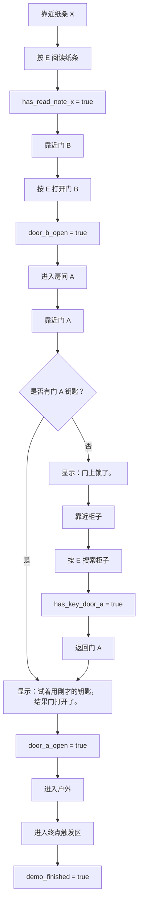

# 最小 Demo 互动对象规格表

## 1. 文档目的

这份文档用于明确废弃小屋 Demo 中每个可互动对象的规则。

实现者应能根据本文档直接确认：

- 对象初始状态是什么。
- 玩家什么时候可以互动。
- 玩家按 E 后发生什么。
- 文本框显示什么。
- 对象状态如何变化。
- 重复互动时如何处理。
- 该对象如何验收。

关联文档：

- [[06 最小Demo设计文档 - 废弃小屋]]
- [[07 最小Demo地图白盒设计]]

## 2. 对象总表

| ID | 对象名 | 区域 | 类型 | 核心作用 |
|---|---|---|---|---|
| obj_note_x | 纸条 X | 房间 B | 文本对象 | 提示玩家离开房间 |
| obj_door_b | 门 B | 房间 B / 房间 A 之间 | 门 | 连接房间 B 与房间 A |
| obj_cabinet_a | 柜子 | 房间 A | 容器对象 | 提供门 A 的钥匙 |
| obj_door_a | 门 A | 房间 A / 户外之间 | 上锁的门 | 需要钥匙才能通往户外 |
| obj_exit_end | 户外终点触发区 | 户外区域 | 触发区 | 触发 Demo 结束 |

## 3. 全局互动规则

### 3.1 互动输入

| 输入 | 功能 |
|---|---|
| E | 与当前最近的可互动对象互动 |

### 3.2 互动提示

| 状态 | 表现 |
|---|---|
| 玩家未靠近可互动对象 | 不显示互动提示 |
| 玩家靠近可互动对象 | 显示 `[E]` 或 `按 E 互动` |
| 玩家离开互动范围 | 互动提示消失 |
| 玩家同时靠近多个对象 | 选择距离玩家最近的对象 |

### 3.3 文本框规则

| 规则 | 说明 |
|---|---|
| 文本显示 | 互动后弹出文本框 |
| 文本关闭 | 玩家按 E、空格或确认键关闭 |
| 移动控制 | 文本显示时建议暂停玩家移动 |
| 文本长度 | 第一版控制在 1 到 3 行 |

### 3.4 状态变量

| 状态变量 | 初始值 | 说明 |
|---|---|---|
| has_read_note_x | false | 玩家是否读过纸条 X |
| door_b_open | false | 门 B 是否已经打开 |
| has_key_door_a | false | 玩家是否已经取得门 A 的钥匙 |
| cabinet_a_searched | false | 柜子是否已经被搜索过 |
| door_a_open | false | 门 A 是否已经打开 |
| demo_finished | false | Demo 是否已经结束 |

## 4. 对象规格：纸条 X

### 4.1 基础信息

| 项目 | 内容 |
|---|---|
| 对象 ID | obj_note_x |
| 显示名 | 纸条 X |
| 所在区域 | 房间 B |
| 类型 | 文本对象 |
| 推荐颜色 | 白色 |
| 推荐形状 | 小纸片、小平面、小方块 |
| 互动半径 | 1.5 到 2 |

### 4.2 初始状态

| 状态 | 内容 |
|---|---|
| 是否可见 | 是 |
| 是否可互动 | 是 |
| 是否阻挡玩家 | 否 |
| 初始变量 | has_read_note_x = false |

### 4.3 互动条件

玩家靠近纸条 X 并按 E。

### 4.4 互动反馈

文本框显示：

```text
纸条上写着：
离开房间。
```

### 4.5 状态变化

| 互动前 | 互动后 |
|---|---|
| has_read_note_x = false | has_read_note_x = true |

### 4.6 重复互动

再次互动仍显示同一段文本。

### 4.7 验收点

- [ ] 玩家靠近纸条 X 时出现互动提示。
- [ ] 玩家按 E 后显示纸条文本。
- [ ] 纸条文本可以关闭。
- [ ] 读完纸条后 `has_read_note_x` 变为 true。
- [ ] 纸条可以重复阅读。

## 5. 对象规格：门 B

### 5.1 基础信息

| 项目 | 内容 |
|---|---|
| 对象 ID | obj_door_b |
| 显示名 | 门 B |
| 所在区域 | 房间 B / 房间 A 之间 |
| 类型 | 普通门 |
| 推荐颜色 | 蓝色 |
| 互动半径 | 1.5 到 2 |

### 5.2 初始状态

| 状态 | 内容 |
|---|---|
| 是否可见 | 是 |
| 是否可互动 | 是 |
| 是否阻挡玩家 | 是 |
| 初始变量 | door_b_open = false |

### 5.3 推荐规则

门 B 推荐采用“读纸条后才能打开”的规则。

原因：这样玩家能体验到最小的信息链路：

```text
阅读纸条 -> 获得目标 -> 打开门 B -> 进入新区域
```

### 5.4 互动条件与反馈

| 条件 | 反馈文本 | 状态变化 |
|---|---|---|
| has_read_note_x = false，玩家互动门 B | 门像是能打开，但你还没有想好要去哪。 | 不打开 |
| has_read_note_x = true，door_b_open = false，玩家互动门 B | 门打开了。 | door_b_open = true |
| door_b_open = true，玩家互动门 B | 无文本，或显示：门已经打开了。 | 不变化 |

### 5.5 打开后表现

门 B 打开后：

- 不再阻挡玩家。
- 视觉上应有打开状态，或者直接隐藏门的阻挡。
- 玩家可以从房间 B 进入房间 A。

### 5.6 验收点

- [ ] 玩家靠近门 B 时出现互动提示。
- [ ] 没有读纸条时互动门 B，不允许通过。
- [ ] 没有读纸条时显示“门像是能打开，但你还没有想好要去哪。”
- [ ] 读过纸条后互动门 B，显示“门打开了。”
- [ ] 门 B 打开后不再阻挡玩家。
- [ ] 玩家可以通过门 B 进入房间 A。

## 6. 对象规格：柜子

### 6.1 基础信息

| 项目 | 内容 |
|---|---|
| 对象 ID | obj_cabinet_a |
| 显示名 | 柜子 |
| 所在区域 | 房间 A |
| 类型 | 容器对象 |
| 推荐颜色 | 棕色 |
| 推荐形状 | 立方体、箱体、矮柜 |
| 互动半径 | 1.5 到 2 |

### 6.2 初始状态

| 状态 | 内容 |
|---|---|
| 是否可见 | 是 |
| 是否可互动 | 是 |
| 是否阻挡玩家 | 可阻挡，也可不阻挡 |
| 初始变量 | cabinet_a_searched = false |
| 初始钥匙状态 | has_key_door_a = false |

### 6.3 互动条件

玩家靠近柜子并按 E。

### 6.4 互动反馈

第一次互动文本：

```text
柜子里有一把钥匙。
```

第一次互动后：

| 互动前 | 互动后 |
|---|---|
| cabinet_a_searched = false | cabinet_a_searched = true |
| has_key_door_a = false | has_key_door_a = true |

### 6.5 重复互动

再次互动文本：

```text
柜子是空的。
```

重复互动不再获得钥匙。

### 6.6 表现要求

- 柜子不需要打开动画。
- 可以在互动后改变颜色或状态，但不是必须。
- 钥匙不需要作为独立 3D 模型出现，可以作为文本和状态获得。

### 6.7 验收点

- [ ] 玩家靠近柜子时出现互动提示。
- [ ] 第一次按 E 显示“柜子里有一把钥匙。”
- [ ] 第一次互动后 `has_key_door_a` 变为 true。
- [ ] 第一次互动后 `cabinet_a_searched` 变为 true。
- [ ] 重复互动显示“柜子是空的。”
- [ ] 重复互动不会重复获得钥匙。

## 7. 对象规格：门 A

### 7.1 基础信息

| 项目 | 内容 |
|---|---|
| 对象 ID | obj_door_a |
| 显示名 | 门 A |
| 所在区域 | 房间 A / 户外区域之间 |
| 类型 | 上锁的门 |
| 推荐颜色 | 红色或橙色 |
| 互动半径 | 1.5 到 2 |

### 7.2 初始状态

| 状态 | 内容 |
|---|---|
| 是否可见 | 是 |
| 是否可互动 | 是 |
| 是否阻挡玩家 | 是 |
| 初始变量 | door_a_open = false |
| 开门条件 | has_key_door_a = true |

### 7.3 互动条件与反馈

| 条件 | 反馈文本 | 状态变化 |
|---|---|---|
| has_key_door_a = false，玩家互动门 A | 门上锁了。 | 不打开 |
| has_key_door_a = true，door_a_open = false，玩家互动门 A | 试着用刚才的钥匙，结果门打开了。 | door_a_open = true |
| door_a_open = true，玩家互动门 A | 无文本，或显示：门已经打开了。 | 不变化 |

### 7.4 打开后表现

门 A 打开后：

- 不再阻挡玩家。
- 玩家可以进入户外区域。
- 门 A 不需要消耗钥匙。
- 钥匙状态可以保留，不需要背包 UI。

### 7.5 验收点

- [ ] 玩家靠近门 A 时出现互动提示。
- [ ] 没有钥匙时互动门 A，显示“门上锁了。”
- [ ] 没有钥匙时门 A 仍然阻挡玩家。
- [ ] 获得钥匙后互动门 A，显示“试着用刚才的钥匙，结果门打开了。”
- [ ] 门 A 打开后不再阻挡玩家。
- [ ] 玩家可以通过门 A 进入户外区域。

## 8. 对象规格：户外终点触发区

### 8.1 基础信息

| 项目 | 内容 |
|---|---|
| 对象 ID | obj_exit_end |
| 显示名 | 户外终点触发区 |
| 所在区域 | 户外区域 |
| 类型 | 触发区 |
| 推荐颜色 | 绿色或亮黄色 |
| 推荐形状 | 地面区域、光圈、出口标记 |
| 触发半径 / 范围 | 2 到 3 |

### 8.2 初始状态

| 状态 | 内容 |
|---|---|
| 是否可见 | 建议可见 |
| 是否可互动 | 不需要按 E |
| 是否阻挡玩家 | 否 |
| 初始变量 | demo_finished = false |

### 8.3 触发条件

玩家进入终点触发区。

### 8.4 触发反馈

文本框或屏幕中央显示：

```text
Demo 结束。
```

### 8.5 状态变化

| 触发前 | 触发后 |
|---|---|
| demo_finished = false | demo_finished = true |

### 8.6 触发后处理

第一版可以任选一种简单处理：

| 方案 | 说明 |
|---|---|
| 停留画面 | 显示“Demo 结束。”，玩家不能继续移动 |
| 允许继续移动 | 显示结束文本后仍允许玩家移动 |
| 返回标题 | 如果已有标题页，可返回标题页 |

推荐第一版使用“停留画面”，最清楚。

### 8.7 验收点

- [ ] 玩家通过门 A 后能看到或自然走到终点触发区。
- [ ] 玩家进入触发区后显示“Demo 结束。”
- [ ] 触发后 `demo_finished` 变为 true。
- [ ] 结束提示不会重复弹出多次。

## 9. 对象交互流程总览



## 10. 需要策划确认的问题

当前建议规则如下：

| 问题 | 当前建议 | 是否需要确认 |
|---|---|---|
| 门 B 是否必须读纸条后才能打开 | 是，读纸条后才能打开 | 是 |
| 钥匙是否需要显示在 UI 或背包里 | 不需要，只记录状态 | 否 |
| 柜子是否需要打开动画 | 不需要 | 否 |
| 门 A 开门是否消耗钥匙 | 不消耗 | 否 |
| 终点触发后是否还能移动 | 推荐不能移动，停留结束画面 | 可后续确认 |

如果只做第一版，以上建议可以直接执行。

## 11. 交付给实现者的对象任务

实现者需要完成：

1. 创建纸条 X，并实现靠近提示、阅读文本、状态记录。
2. 创建门 B，并实现读纸条前/后的不同互动反馈。
3. 创建柜子，并实现第一次获得钥匙、重复互动为空。
4. 创建门 A，并实现无钥匙上锁、有钥匙打开。
5. 创建户外终点触发区，并实现 Demo 结束提示。
6. 确保所有互动对象使用同一个交互按键 E。
7. 确保同一时间只触发距离玩家最近的互动对象。
8. 确保所有反馈文本都能正常显示和关闭。

## 12. 策划验收清单

- [ ] 纸条 X 可阅读，文本正确。
- [ ] 读纸条前门 B 不能打开，或按当前确认规则执行。
- [ ] 读纸条后门 B 可以打开。
- [ ] 门 B 打开后可以进入房间 A。
- [ ] 没有钥匙时门 A 显示“门上锁了。”
- [ ] 柜子第一次互动显示“柜子里有一把钥匙。”
- [ ] 柜子第一次互动后获得钥匙状态。
- [ ] 柜子重复互动显示“柜子是空的。”
- [ ] 有钥匙后门 A 显示“试着用刚才的钥匙，结果门打开了。”
- [ ] 门 A 打开后可以进入户外。
- [ ] 户外终点触发“Demo 结束。”
- [ ] 整个流程没有卡死点。

