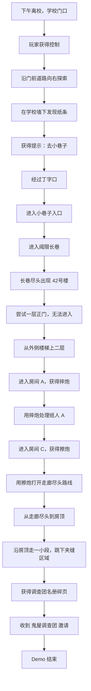

# Demo 流程文档 - 42号楼 v0.2

## 1. 版本定位

本版本是《千禧年战纪：42号楼》的新版 Demo 流程。

它不再追求旧版中“家 -> 学校门口 -> 小卖部 -> 小刀一把 -> 神秘商店 -> 四种武器 -> 42号楼”的大范围流程，而是基于已经验证过的两个原型：

- [[06 最小Demo设计文档 - 废弃小屋]]：探索、门、钥匙、文本、出口的基础交互经验。
- [[13 爆竹射击白盒原型设计]]：固定上帝视角、鼠标控制人物朝向、摔炮、擦炮、靶子反馈。

本版本目标是第一次验证真正的核心循环：

```text
学校门口日常 -> 学校墙下纸条 -> 小巷入口 -> 阈限长巷 -> 42号楼探索 -> 获得爆竹 -> 用爆竹处理障碍 -> 获得调查团名册碎页 -> 收到组织邀请
```

## 2. Demo 一句话

下午离校时，小陈从学校门口出发，在老孟小卖铺对面、学校墙下面发现一张奇怪纸条，随后沿丁字口下方的小巷进入一条不该那么长的路，最终抵达 42号楼，并在楼内、房顶和夹缝区域中找到调查团名册碎页。

## 3. 设计目标

本 Demo 要验证：

- 学校门口的日常入口是否成立。
- 学校墙下纸条能否自然引导玩家走向小巷子。
- 学校门口、老孟小卖部、丁字口和小巷入口的位置关系是否清楚。
- 离校后的氛围是否能自然过渡到异常空间。
- 固定上帝视角探索是否适合 42 号楼。
- 鼠标控制人物朝向是否能接入正式 Demo。
- 摔炮和擦炮能否作为推进地图的工具。
- 爆竹命中靶子 / 纸人后能否触发空间变化。
- 文本、探索、爆竹、路线解锁和结尾能否组成一个完整短流程。
- 结尾的“鬼屋调查团”邀请是否能作为主线钩子。

## 4. 当前范围

### 4.1 必须包含

| 类别 | 内容 |
|---|---|
| 主角 | 小陈 |
| 起点 | 下午离校时的学校门口 |
| 日常区域 | 学校门口、门前道路、老孟小卖部、丁字口、小巷子入口 |
| 异常区域 | 42号楼 |
| 武器 | 摔炮、擦炮 |
| 互动 | 学校墙下纸条、门、柜子、爆竹拾取、名册碎页 |
| 靶子 | 静止纸人 / 纸团靶 |
| 结尾 | 获得调查团名册碎页，收到“鬼屋调查团”邀请 |

### 4.2 暂不包含

- 家庭开场
- 学校内部
- 小卖部内部
- 老孟正式对话
- 小刀一把小游戏
- 神秘商店
- 魔术棒
- 窜天猴
- 敌人 AI
- 玩家受伤
- Boss
- 完整组织系统
- 复杂任务 UI

> [!important] 当前版本原则
> 这是“探索 + 爆竹射击合流”的第一版 42号楼 Demo，不是完整游戏章节。

## 5. 流程总览



## 6. 详细流程

### 6.1 第一段：下午离校，学校门口

场景：

- 学校门口外侧。
- 下午离校时。
- 学生已经散得差不多。
- 学校大门在左上，左侧是保安亭，右侧是教学楼 / 学校围墙。
- 学校大门对面是一排店铺，包括儿童托管等日常店铺。
- 光线偏黄，窗外有黄昏感。
- 场景仍然是日常，不要一开始就恐怖。

玩家目标：

> 看看学校门口。

关键对象：

| 对象 | 功能 |
|---|---|
| 学校大门 | 起点地标，确认玩家刚从学校出来 |
| 保安亭 | 现实感地标，暂不进入 |
| 教学楼 / 学校围墙 | 场景边界，阻挡玩家回到学校内部 |
| 儿童托管 / 店铺 | 街道生活感背景 |
| 学校墙下纸条 | 主线提示，引导玩家去小巷子 |

纸条建议文本：

```text
纸条上写着：
去小巷子。
别让他们看见。
```

纸条位置：

```text
老孟小卖铺对面。
学校墙下面。
不是贴在墙上，是被风吹到墙根，像刚刚才停在那里。
```

### 6.2 第二段：丁字口与小巷子入口

场景：

- 玩家沿学校门前道路从左往右走。
- 道路尽头形成一个丁字口。
- 丁字口左侧是奶茶店。
- 丁字口右侧是老孟小卖部。
- 丁字口下方是小巷子入口。
- 日常空间到这里仍然应该成立，但小巷子入口开始显得不太对。

玩家目标：

> 去小巷子看看。

可选调查：

| 对象 | 文本作用 |
|---|---|
| 奶茶店 | 现实地标，帮助玩家确认丁字口方向 |
| 老孟小卖部 | 关键地标，纸条在它对面的学校墙下 |
| 小巷子入口 | 通向异常入口 |

小巷入口文本示例：

```text
这条巷子你以前也见过。
但你不记得它有这么深。
```

### 6.3 第三段：阈限长巷

触发：

- 玩家进入小巷子入口。
- 切换到阈限长巷地图。

表现：

- 巷子比现实中更长。
- 两侧墙体重复。
- 门牌、管线、墙缝和灯重复出现。
- 墙面颜色变得灰白。
- 光线色温偏黄、色调偏绿。
- 暗部被抬亮，不要死黑。
- 走到尽头后，42号楼出现。

玩家目标：

> 进入 42号楼。

过渡文本：

```text
你往前走了一会儿。
两边的墙一直没有变。
你回头看，学校门口已经看不见了。
```

## 7. 42号楼关卡结构

### 7.1 空间结构

```text
42号楼外部
  -> 一层正门：无法进入
  -> 外侧楼梯：上到二层
  -> 二层露天走廊
  -> 房间 A：旧柜子，获得摔炮
  -> 房间 B：纸人障碍，摔炮教学
  -> 房间 C：获得擦炮，处理远处障碍
  -> 走廊尽头：到达旁边房顶
  -> 房顶路线：走一小段后跳下
  -> 夹缝区域：获得调查团名册碎页
  -> Demo 结束
```

### 7.2 空间示意

```text
小巷尽头
  ↓
42号楼外部
  ├── 一层正门：锁住
  └── 外侧楼梯
        ↓
    二层露天走廊
      ├── 房间 A：旧柜子 / 摔炮
      ├── 房间 B：纸人 A / 摔炮教学
      ├── 房间 C：擦炮 / 纸人 B
      └── 走廊尽头
            ↓
        旁边房顶
            ↓
        夹缝区域：调查团名册碎页
```

## 8. 爆竹教学设计

### 8.1 摔炮教学

目标：

> 让玩家理解左键投掷、落地即爆、爆炸可以处理纸人障碍。

流程：

1. 玩家进入房间 A，在旧柜子中获得摔炮。
2. 玩家来到房间 B 或二层走廊，前方有纸人 A 挡路。
3. 玩家切换或默认装备摔炮。
4. 鼠标控制人物朝向。
5. 左键投掷摔炮。
6. 摔炮落地立刻爆炸。
7. 纸人 A 消失。
8. 房间 B 或走廊障碍可以通过。

提示文本：

```text
柜子里有一盒摔炮。
```

纸人 A 被炸开后文本：

```text
纸人散了一地。
走廊那边有风吹出来。
```

### 8.2 擦炮教学

目标：

> 让玩家理解右键点火、5 秒倒计时、左键投掷、延迟爆炸。

流程：

1. 玩家进入房间 C。
2. 地上或桌上有一盒擦炮。
3. 玩家拾取擦炮。
4. 远处有纸人 B 或障碍物。
5. 玩家右键点火。
6. UI 显示 5 秒倒计时。
7. 玩家左键投掷擦炮。
8. 擦炮倒计时结束后爆炸。
9. 纸人 B 消失或远处障碍解除。
10. 走廊尽头的屋顶路线可用。

提示文本：

```text
这盒擦炮还没受潮。
点着以后，别拿太久。
```

擦炮命中后文本：

```text
爆炸声在楼道里绕了一圈。
走廊尽头有什么东西松开了。
```

## 9. 人物朝向与射击规则

本 Demo 直接沿用 [[13 爆竹射击白盒原型设计]] 的人物朝向规则：

- WASD 控制移动。
- 鼠标控制人物朝向。
- 人物朝向不由移动方向决定。
- 玩家可以边移动边朝鼠标方向瞄准。
- 投掷方向使用人物当前朝向。
- 镜头固定，不可旋转，始终跟随玩家。
- 镜头不是越肩视角，而是固定上帝视角 / 斜俯视第三人称。

## 10. 关键道具

| 道具 | 获得位置 | 用途 |
|---|---|---|
| 纸条 | 老孟小卖铺对面，学校墙下面 | 引导去小巷子 |
| 摔炮 | 42号楼房间 A 旧柜子 | 炸开纸人 A |
| 擦炮 | 房间 C 桌面 / 地面 | 炸开纸人 B 或远处障碍，打开屋顶路线 |
| 调查团名册碎页 | 42号楼和其他房子之间的夹缝区域 | 结尾主线钩子 |
| 圆牌徽章 | 结尾自动获得，可选 | 表示“鬼屋调查团”注意到了玩家 |

## 11. 结尾

玩家在夹缝区域获得调查团名册碎页后，触发结尾。

名册碎页文本：

```text
这是一张从旧本子上撕下来的纸。
上面有几个名字。
最后一行空着。
```

玩家抬头时，42号楼的二层走廊已经看不清了。

结尾文本：

```text
你站在两栋楼之间。
学校的声音已经完全听不见了。

书包里多了一张纸。
纸背面写着：

鬼屋是真的，别乱说。
```

屏幕显示：

```text
Demo 结束
你已经被“鬼屋调查团”注意到了。
```

## 12. 氛围要求

沿用 [[11 最小Demo氛围与文本替换方案]] 的色彩原则：

- 物体先有固有色。
- 墙面是灰白、旧白、脏白。
- 地面是灰水泥地。
- 黄昏是光照效果，不是材质颜色。
- 室内灯光色温偏黄、色调偏绿。
- 中间调偏青，阴影偏蓝绿，高光偏黄。
- 暗部抬亮，不要死黑。
- 降低清晰度和纹理，形成柔光梦核感。

42号楼内部不要做成纯黑恐怖屋。它应该是：

```text
熟悉的学校门口 / 老楼走廊结构 + 不合理的空间 + 黄绿色柔光 + 灰白水泥质感
```

## 13. 当前不做内容

本版暂时不做：

- 小刀一把
- 小卖部内部
- 神秘商店
- 老孟正式对话
- 王小虎小游戏挑战
- 魔术棒
- 窜天猴
- 移动敌人
- 玩家受伤
- Boss
- 复杂任务 UI
- 存档

这些内容后续再扩展。

## 14. 验收清单

### 14.1 P0 必须通过

- [ ] 玩家从下午离校时的学校门口开始。
- [ ] 学校大门左侧有保安亭，右侧有教学楼 / 学校围墙。
- [ ] 玩家可以沿学校门前道路从左往右移动。
- [ ] 玩家可以在老孟小卖铺对面、学校墙下面调查纸条。
- [ ] 纸条提示玩家去小巷子。
- [ ] 玩家可以经过丁字口，从下方进入小巷子。
- [ ] 玩家可以穿过阈限长巷并抵达 42号楼。
- [ ] 玩家无法从 42号楼一层正门进入。
- [ ] 玩家可以通过外侧楼梯上到二层走廊。
- [ ] 镜头固定、不可旋转、始终跟随玩家。
- [ ] 鼠标可以控制人物朝向。
- [ ] 玩家可以获得摔炮。
- [ ] 玩家可以用摔炮炸开纸人 A。
- [ ] 纸人 A 消失或解除阻挡。
- [ ] 玩家可以进入房间 B / 房间 C。
- [ ] 玩家可以获得擦炮。
- [ ] 玩家可以右键点燃擦炮。
- [ ] 擦炮开始 5 秒倒计时。
- [ ] 玩家可以左键投掷擦炮。
- [ ] 擦炮爆炸后纸人 B 或障碍解除。
- [ ] 走廊尽头的屋顶路线打开。
- [ ] 玩家可以从走廊尽头到达房顶。
- [ ] 玩家可以从房顶跳下到夹缝区域。
- [ ] 玩家可以在夹缝区域获得调查团名册碎页。
- [ ] 玩家获得名册碎页后触发结尾。

### 14.2 P1 建议通过

- [ ] 学校门口日常感成立。
- [ ] 学校墙下纸条的位置清楚。
- [ ] 丁字口、小巷子入口的方向清楚。
- [ ] 阈限长巷异常过渡清楚。
- [ ] 摔炮教学不需要额外说明也能理解。
- [ ] 擦炮教学能让玩家理解点火和倒计时。
- [ ] 纸人 / 靶子反馈清楚。
- [ ] 屋顶路线和夹缝区域的空间关系清楚。
- [ ] 结尾“鬼屋调查团”钩子清楚。
- [ ] 氛围不是纯恐怖，而是中式梦核。

## 15. 交付给实现者的最小任务

实现者第一版只需要完成：

1. 学校门口起点。
2. 老孟小卖铺对面、学校墙下面的纸条调查。
3. 丁字口和小巷子入口。
4. 阈限长巷过渡。
5. 42号楼小型关卡。
6. 摔炮获取与使用。
7. 纸人 A 阻挡与被摔炮炸开。
8. 擦炮获取、点火、倒计时、投掷。
9. 纸人 B / 障碍解除，打开屋顶路线。
10. 房顶路线和夹缝区域。
11. 调查团名册碎页获取。
12. 结尾文本。

## 16. 关联地图方案

新的空间路线已扩展为：

```text
学校门口 -> 老孟小卖部附近 -> 小巷子入口 -> 阈限长巷 -> 42号楼 -> 二层走廊 -> 房顶 -> 夹缝区域
```

详细地图白盒见 [[15 Demo地图白盒设计 - 学校门口至42号楼]]。
