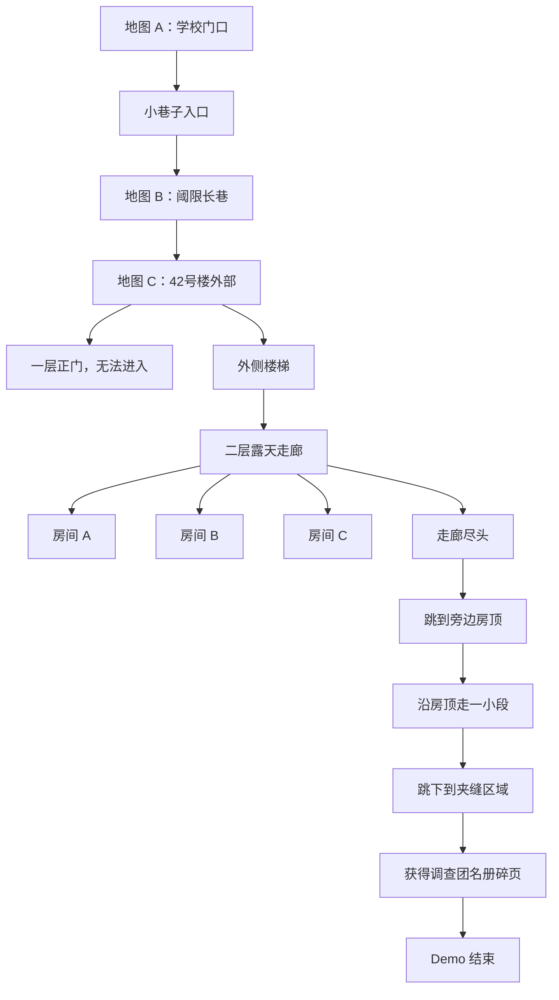

# Demo 地图白盒设计 - 学校门口至42号楼

## 1. 地图定位

本地图方案用于《千禧年战纪：42号楼》Demo。

当前 Demo 不再从学校楼内直接切入 42号楼，而是采用更完整的三段式空间过渡：

```text
学校门口日常区 -> 阈限长巷 -> 42号楼
```

设计目标：

- 让玩家先看见真实、生活化的学校门口。
- 让老孟小卖部和小巷子入口成为日常与异常之间的缓冲。
- 通过一条单向、重复、很长的小巷子制造阈限空间感。
- 在巷子尽头出现 42号楼，让“鬼屋”像是从日常地图里长出来的。
- 让 42号楼的可玩空间集中在二层露天走廊、三个房间、屋顶路线和夹缝区域，形成一个小型探索段落。

## 2. 总体结构



## 3. 地图 A：学校门口日常区

### 3.1 来源识别

对应手绘图第一张，并根据后续说明修正学校门口方位。

我识别到的主要元素：

- 学校大门位于地图左上方。
- 学校大门左侧是保安亭。
- 学校大门右侧有一栋教学楼，教学楼在白盒中承担学校围墙的作用。
- 学校大门对面是一排店铺，包括儿童托管等日常店面。
- 学校大门和店铺之间有一条横向道路。
- 玩家沿这条道路从左往右走，会到达一个丁字口。
- 丁字口左侧是奶茶店，右侧是老孟小卖部。
- 丁字口下方就是进入小巷子的入口。
- 主线纸条位于老孟小卖铺对面，也就是学校墙下面。

### 3.2 地图功能

学校门口日常区承担三个功能：

1. 建立现实空间：玩家知道自己刚离开学校。
2. 建立生活气质：小店、小卖部、操场、校门、街道都要像普通地方。
3. 引导玩家进入异常：学校墙下纸条提供目标，小巷子入口是唯一推进点。

### 3.3 白盒结构

```text
左上：学校区域

保安亭  学校大门  教学楼 / 学校围墙
  │        │              │
  └────────┴──────────────┘
           门前道路，从左往右
  儿童托管 / 店铺 / 店铺 / 店铺
                           │
                         丁字口
                    奶茶店   老孟小卖部
                           │
                        小巷子入口
                           │
                           ↓
                      切换到地图 B
```

### 3.4 玩家路线

推荐玩家路线：

```text
学校大门出生点 -> 沿门前道路向右走 -> 老孟小卖铺对面的学校墙下纸条 -> 丁字口 -> 老孟小卖部附近 -> 小巷子入口 -> 进入阈限长巷
```

### 3.5 关键对象

| 对象 | 类型 | P0 功能 | P1 功能 |
|---|---|---|---|
| 学校大门 | 场景地标 | 玩家出生点附近，建立地点 | 可加入放学人群残影 |
| 保安亭 | 场景地标 | 放在学校大门左侧，强化真实学校门口 | 后续加入保安观察文本 |
| 教学楼 / 围墙 | 场景边界 | 放在学校大门右侧，阻挡玩家进入学校深处 | 后续加入窗户、标语 |
| 儿童托管 | 背景店铺 | 位于学校对面，强化小学门口生态 | 后续加入招牌和调查文本 |
| 学校墙下纸条 | 主线交互物 | 位于老孟小卖铺对面、学校墙下面，引导玩家去小巷子 | 后续加入风吹纸条或被踩过的表现 |
| 奶茶店 | 丁字口地标 | 位于丁字口左侧，帮助玩家辨认路口 | 后续加入学生聚集痕迹 |
| 老孟小卖部 | 地标 / NPC 点 | 位于丁字口右侧，作为小巷入口前的关键地标 | 后续加入老孟对话和道具 |
| 普通店铺 | 背景建筑 | 丰富街道边界 | 后续做调查文本 |
| 小巷子入口 | 地图切换点 | 进入地图 B | 进入前可弹出一段不安文本 |

### 3.6 实现约束

- 这张地图只做外部，不进入学校内部和小卖部内部。
- 店铺只需要正面立面和碰撞体，不需要完整室内。
- 操场作为背景或封闭区域，不开放。
- 玩家应能在 20 到 40 秒内从学校门口走到小巷子入口。
- 丁字口必须清楚：左边奶茶店，右边老孟小卖部，下方进入小巷子。
- 主线纸条必须放在老孟小卖铺对面、学校墙下面，不能放在教室、走廊或小巷内部。

## 4. 地图 B：阈限长巷

### 4.1 来源识别

对应手绘图第二张。

我识别到的主要元素：

- 一条非常长、很窄、几乎没有分支的小巷子。
- 两侧是连续墙体。
- 这是从日常街道到 42号楼之间的过渡地图。

### 4.2 地图功能

长巷不是复杂玩法地图，而是氛围转换地图。

它的职责：

- 把玩家从现实街道慢慢推入异常。
- 制造“走了很久，但景物没有变化”的阈限空间感。
- 让 42号楼的出现更突然、更不合理。

### 4.3 白盒结构

```text
入口
  ↓
重复巷道段 1
  ↓
重复巷道段 2
  ↓
重复巷道段 3
  ↓
异常加重段
  ↓
42号楼外部
```

### 4.4 设计规则

| 规则 | 说明 |
|---|---|
| 单向前进 | 玩家进入后只需要一直向前走 |
| 无分支 | 第一版不做岔路，避免迷路 |
| 可回头但无收益 | 玩家可以回头，但不放关键内容 |
| 重复元素 | 墙、门牌、管线、灯、垃圾桶可以重复出现 |
| 异常递进 | 越靠近尽头，黄绿色光感越明显 |
| 不做战斗 | 第一版只负责氛围，不加入敌人 |

### 4.5 氛围递进

| 段落 | 视觉 | 文本 / 反馈 |
|---|---|---|
| 入口段 | 仍像普通小巷 | 从外面还能听见学校和街道声音 |
| 重复段 1 | 墙面、门牌开始重复 | 玩家可能看到同样的墙缝 |
| 重复段 2 | 光线更黄绿，暗部抬亮 | 脚步声变空 |
| 重复段 3 | 小巷比外面看起来更长 | 回头时入口不明显 |
| 尽头段 | 42号楼出现 | 前方出现不该在这里的二层楼 |

## 5. 地图 C：42号楼

### 5.1 来源识别

对应手绘图第三张和第四张。

我识别到的主要元素：

- 玩家从小巷子方向进入 42号楼外部。
- 一层有正门，但正门不能进入。
- 楼旁有外侧楼梯，可以上到二层。
- 二层是一条露天走廊。
- 二层走廊上有三个房间：A、B、C。
- 房间和走廊像老式公寓或家属院二层楼。
- 走廊尽头连接着其他一层房子的房顶。
- 玩家可以从二层走廊尽头跳到旁边房顶。
- 玩家沿房顶走一小段路后，再跳下到一个夹在其他房子和 42号楼之间的窄区域。

### 5.2 地图功能

42号楼是 Demo 的核心可玩地图。

它要完成：

- 第一次让玩家确认“鬼屋”是真实空间。
- 用一层封闭门引导玩家寻找楼梯。
- 在二层露天走廊组织三个房间的线性探索。
- 通过走廊尽头、屋顶和夹缝区域扩展 42号楼的空间层次。
- 放置摔炮、擦炮、纸人障碍和调查团名册碎页。

### 5.3 白盒结构

```text
小巷子出口
    ↓
42号楼外部
    ├── 一层正门：锁住，无法进入
    └── 外侧楼梯
            ↓
        二层露天走廊
            ├── 房间 A：获得摔炮
            ├── 房间 B：摔炮教学 / 纸人障碍
            ├── 房间 C：获得擦炮 / 打开屋顶路线前置
            └── 走廊尽头：跳到旁边房顶
                    ↓
              其他一层房子的房顶
                    ↓
              跳下到夹缝区域
                    ↓
              最终调查物
```

### 5.4 一层设计

| 元素 | 功能 |
|---|---|
| 一层正门 | 告诉玩家“正门进不去” |
| 门锁 / 封条 | 强化废弃感 |
| 楼旁外梯 | 真正的可行路线 |
| 楼体外墙 | 建立 42号楼的辨识度 |

一层正门交互文本建议：

```text
门从里面锁住了。
门缝里没有光。
```

玩家目标更新：

```text
找找别的入口。
```

### 5.5 二层露天走廊

二层走廊是本地图的核心导航轴。

设计要求：

- 走廊必须能一眼看见 A、B、C 三个房间门。
- 走廊外侧有护栏或低墙，防止玩家掉出地图。
- 走廊尽头连接屋顶路线，是进入夹缝区域的起点。
- 镜头固定斜俯视时，房间门口不能被屋檐遮挡。
- 走廊尽头的可跳跃位置要有明显视觉提示，例如断开的护栏、低矮屋檐、白色粉笔箭头或脚印。

### 5.6 三个房间功能

| 房间 | 设计功能 | 主要对象 | 玩家学到什么 |
|---|---|---|---|
| 房间 A | 安全探索房 | 旧柜子、摔炮 | 42号楼内可以获得爆竹 |
| 房间 B | 摔炮教学房 | 纸人 A、门或障碍 | 摔炮落地即爆，可以解除近处阻挡 |
| 房间 C | 擦炮教学房 | 擦炮、纸人 B、屋顶路线提示 | 擦炮需要点火和等待，爆炸后可以打开继续探索的路 |

### 5.7 屋顶路线

屋顶路线是 42号楼的扩展段落。

它不追求复杂平台跳跃，而是让玩家感到自己真的离开了正常楼道，进入了孩子才会走的危险小路。

```text
二层走廊尽头
  -> 跳到旁边一层房子的房顶
  -> 沿房顶走一小段
  -> 跳下到夹缝区域
```

实现建议：

| 元素 | P0 做法 | 说明 |
|---|---|---|
| 走廊尽头跳跃点 | 触发区 / 按 E 翻过去 | 不做复杂跳跃操作 |
| 房顶 | 短线性通道 | 宽度略窄，但不能让玩家卡住 |
| 房顶边缘 | 低墙或视觉边界 | 防止误走出地图 |
| 跳下点 | 触发区 / 按 E 跳下 | 播放短文本或短动作即可 |
| 夹缝入口 | 落点区域 | 玩家落下后进入最终探索区 |

屋顶路线氛围：

- 房顶比走廊更安静。
- 能看到 42号楼的墙贴得很近。
- 远处学校和小卖部的声音已经听不见。
- 玩家会感到自己走到了“大人不会走、小孩才会钻”的地方。

### 5.8 夹缝区域

夹缝区域位于其他房子和 42号楼之间。

设计定位：

- 这是 42号楼 Demo 的最终空间。
- 空间应该窄、压迫、灰白、水泥质感强。
- 它不再像普通房间，而像建筑之间剩下来的阴影。
- 调查团名册碎页建议放在这里，而不是房间 C。

白盒结构：

```text
房顶跳下点
    ↓
夹缝区域
    ├── 废旧木板 / 杂物
    ├── 最后纸人或障碍
    └── 调查团名册碎页
```

夹缝区域交互文本建议：

```text
这里夹在两栋楼中间。
风进不来，声音也出不去。
```

调查团名册碎页位置建议：

```text
一块掉下来的水泥板下面，压着半张纸。
```

### 5.9 推荐流程

```text
1. 玩家从长巷尽头进入 42号楼外部。
2. 玩家尝试一层正门，发现无法进入。
3. 玩家沿外侧楼梯上到二层露天走廊。
4. 玩家进入房间 A，调查旧柜子，获得摔炮。
5. 玩家在房间 B 或走廊处遇到纸人 A。
6. 玩家用摔炮炸开纸人 A。
7. 玩家进入房间 C，获得擦炮。
8. 玩家用擦炮处理纸人 B 或远处障碍，打开走廊尽头路线。
9. 玩家从走廊尽头跳到旁边房顶。
10. 玩家沿房顶走一小段。
11. 玩家跳下到夹缝区域。
12. 玩家调查夹缝区域，获得调查团名册碎页。
13. 触发结尾：“鬼屋是真的，别乱说。”
```

## 6. 地图切换规则

| 起点 | 终点 | 方式 | 是否可返回 |
|---|---|---|---|
| 学校门口小巷子入口 | 阈限长巷入口 | 触发区切换 | P0 可不返回 |
| 阈限长巷尽头 | 42号楼外部 | 触发区切换 | P0 可不返回 |
| 二层走廊尽头 | 其他房子房顶 | 触发区 / 按 E 翻越 | P0 可不返回 |
| 房顶跳下点 | 夹缝区域 | 触发区 / 按 E 跳下 | P0 可不返回 |
| 42号楼结尾 | Demo 结束 | 文本 / 黑屏 / 结束 UI | 不返回 |

P0 阶段建议采用单向流程，降低实现复杂度。

## 7. 美术白盒要求

| 地图 | 白盒重点 | 暂不追求 |
|---|---|---|
| 学校门口 | 校门、保安亭、教学楼围墙、T 字口、小卖部、小巷入口的位置关系 | 店铺细节、完整室内 |
| 阈限长巷 | 窄、长、重复、单向 | 复杂分支、谜题 |
| 42号楼 | 一层封闭、外楼梯、二层走廊、三房间、屋顶路线、夹缝区域 | 完整建筑内部、多楼层 |

## 8. 验收标准

### 8.1 地图连通性

- [ ] 学校大门位于地图左上方，左侧有保安亭，右侧有教学楼围墙。
- [ ] 学校大门对面有儿童托管等店铺。
- [ ] 玩家能沿门前道路从左往右走到丁字口。
- [ ] 玩家能在老孟小卖铺对面、学校墙下面找到主线纸条。
- [ ] 丁字口左侧是奶茶店，右侧是老孟小卖部。
- [ ] 玩家能从丁字口下方找到小巷子入口。
- [ ] 玩家能从学校门口走到老孟小卖部附近。
- [ ] 玩家能找到小巷子入口。
- [ ] 玩家能从小巷子入口切换到阈限长巷。
- [ ] 玩家能沿长巷抵达 42号楼。
- [ ] 玩家无法从 42号楼一层正门进入。
- [ ] 玩家能通过外侧楼梯上到二层。
- [ ] 玩家能进入二层 A、B、C 三个房间。
- [ ] 玩家能从二层走廊尽头到达旁边房顶。
- [ ] 玩家能沿房顶走一小段路。
- [ ] 玩家能从房顶跳下到夹缝区域。

### 8.2 玩法流程

- [ ] 房间 A 能获得摔炮。
- [ ] 房间 B 能完成摔炮处理纸人障碍。
- [ ] 房间 C 能获得擦炮。
- [ ] 玩家能用擦炮处理纸人 B 或远处障碍，打开走廊尽头路线。
- [ ] 玩家能在夹缝区域获得调查团名册碎页。
- [ ] 结尾能显示“鬼屋是真的，别乱说。”

### 8.3 氛围目标

- [ ] 学校门口仍然像现实日常空间。
- [ ] 长巷有明显重复和阈限空间感。
- [ ] 42号楼不像普通可进入建筑，而像突然出现的鬼屋。
- [ ] 二层露天走廊有老式家属院 / 公寓感。
- [ ] 屋顶路线有孩子钻近路、翻房顶的感觉。
- [ ] 夹缝区域有被建筑挤压出来的梦核压迫感。

## 9. 当前待定

| 问题 | 当前建议 |
|---|---|
| 学校门口是否加入 NPC | P0 不加，P1 加老孟或阿杰 |
| 长巷是否允许回头 | P0 允许回头但不做内容 |
| 42号楼三个房间是否必须全部可进 | P0 全部可进，但每间功能简单 |
| 一层是否完全不可进 | P0 完全不可进，只做门和反馈 |
| 屋顶跳跃是否需要动作系统 | P0 不做复杂跳跃，用触发区或按 E 翻越 |
| 结尾是否在房间 C 触发 | 改为夹缝区域触发，房间 C 负责打开屋顶路线 |

## 10. 关联文档

- [[14 Demo流程文档 - 42号楼 v0.2]]
- [[13 爆竹射击白盒原型设计]]
- [[11 最小Demo氛围与文本替换方案]]
- [[04 内容表]]
